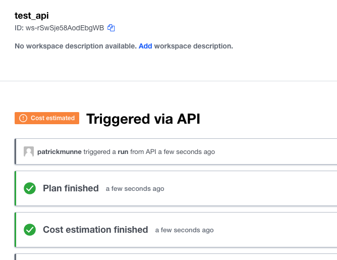

# api_run_python

This script is based on the documentation from HashiCorp "The API-driven Run Workflow" which can be found [here](https://www.terraform.io/cloud-docs/run/api)

With this python script you can push a new configuration into an existing workspace on your TFE/TFC environment. 

# Prerequisites

## Python
Make sure you have Python3 installed to use this script

## Workspace
Have an existing "API-driven Workflow" workspace

## API token
Have an API token that have permissions on the workspace you want to use

# How to

- Clone the repository to your local machine
```
git clone https://github.com/munnep/api_run_python.git
```
- Go to the directory
```
cd api_run_python
```
- export you TOKEN as an environment variable
```
export TOKEN=<your_api_token>
```
- Create a run with the terraform code from `example/main.tf`
```
python3 api_workflow.py patrickmunne test_api /Users/patrickmunne/git/api_run_python
```
- In the workspace you should see the plan has run  
    

# TODO

# DONE
- [x] create python script for API run workflow

